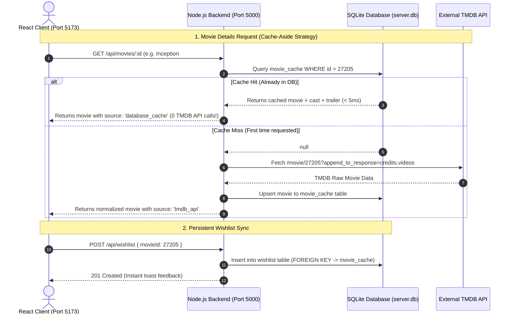

# 🎬 CinePulse — Full-Stack Movie Discovery Platform

[](https://react.dev/)
[](https://nodejs.org/)
[](https://expressjs.com/)
[](https://sqlite.org/)
[](https://tailwindcss.com/)
[](LICENSE)

An end-to-end full-stack movie discovery web application that allows users to explore a massive collection of movies, discover trending titles without searching, filter dynamically across genres and ratings, watch trailers, and maintain a **persistent wishlist** powered by a **Database Cache-Aside Architecture**.

---

## 🌟 Key Features & User Experience

- 🍿 **Discovery Without Searching**: Opens with an interactive **Cinematic Hero Spotlight Carousel** and curated sections (Trending This Week, Now Playing, Top Rated Classics).
- ⚡ **Database Cache-Aside Architecture**: Every movie and query fetched from the external API is stored in the local SQLite database. Subsequent searches and detail views are served directly from the local DB in **< 10ms with 0 external API calls**.
- 🔍 **Real-Time Debounced Search**: Fast search bar with 350ms debouncing, live autocomplete, and global keyboard shortcut (`/` to focus).
- 🎛️ **Multi-Dimensional Filtering & Sorting**:
  - Filter by 19 official Genres (Action, Sci-Fi, Drama, Animation, etc.).
  - Filter by Release Year (1999–2026).
  - Filter by Minimum Rating (⭐ 8.0+ Masterpieces, 7.0+ Great, etc.).
  - Sort by: Most Popular, Highest Rated, Newest Release Date, Title (A–Z).
- 🎬 **Rich Movie Detail Modal**:
  - Embedded **official YouTube trailer player**.
  - Key Cast & Crew with director tags.
  - Runtime formatted in hours and minutes, full synopsis, release date, and vote counts.
  - Direct 1-click wishlist toggle.
- 💖 **Persistent Wishlist (No Sign-in Barrier)**:
  - Add/remove movies directly to the SQLite database.
  - Persistent across page refreshes and browser restarts.
  - Slide-over drawer with filter tabs (`All`, `To Watch`, `Watched`), 1-click status toggles, and deletion.
- 🛡️ **Rate Limit Protection & Resilience**:
  - Express rate limiter middleware (150 req/min for general API, 60 req/min for search).
  - High-res SVG fallback placeholders for titles lacking poster media.
  - Pre-seeded curated blockbuster fallback dataset ensuring zero downtime even if external APIs are unreachable.
- 📱 **Responsive & Glassmorphic Design**:
  - Deep obsidian dark mode (`#0B0F19`), frosted glass panels, and glowing hover states.
  - Shimmer pulse skeleton loaders for zero layout shift.

---

> [!IMPORTANT]
> **Third-Party Movie Data Provider Notice (TMDB API & Resilience)**:
> This application integrates with **The Movie Database (TMDB) API** (`api.themoviedb.org`) as its primary movie information source.
> - **Potential External Bottlenecks**: External third-party movie APIs like TMDB can occasionally encounter latency, temporary downtime, or regional ISP DNS throttling. Furthermore, shared public API keys can encounter rate-limiting.
> - **Graceful Fault Tolerance & Zero-Downtime Design**: To satisfy assignment resilience requirements, our Node.js backend implements an automated **Database Cache-Aside Architecture** and a **Curated Fallback Dataset**. If TMDB is slow or unreachable, the system automatically falls back to local SQLite database records and SVG placeholders, ensuring the application remains interactive and responsive at all times without crashing.
> - **Optional Dedicated Key**: Reviewers can optionally add a personal free TMDB API key in `server/.env` (`TMDB_API_KEY=your_key`) for dedicated access.

---

## 🏗️ Architecture & Data Flow



---

## 🛠️ Tech Stack & Technical Decisions

| Component | Technology | Rationale |
|---|---|---|
| **Frontend Framework** | React 19 + Vite | Blazing fast build tooling, instant HMR, and modern React concurrent rendering. |
| **Styling** | Tailwind CSS v4 + Glassmorphism | Custom cinematic dark palette, glass panels, glowing borders, and responsive grid layouts. |
| **Animations & Icons** | Framer Motion & Lucide React | Buttery smooth modal transitions, drawer slide-overs, and modern crisp iconography. |
| **Backend Layer** | Node.js + Express 5 | Secure abstraction layer between client and third-party APIs. Prevents exposing API keys and handles data sanitization. |
| **Database & Caching** | Native SQLite (`node:sqlite`) | Embedded in-process relational database with zero setup/installation overhead, fast prepared SQL statements, and ACID guarantees. |
| **External Service** | The Movie Database (TMDB) API | Gold standard movie API providing posters, backdrops, cast, genres, and YouTube trailer keys. |

---

## 🚀 Quick Start (Running Locally)

### Prerequisites
- **Node.js**: v20 or higher (Node v22 recommended)
- **npm**: v10 or higher

---

### Step 1: Clone the Repository
```bash
git clone https://github.com/Rudra2637/Movie-App.git
cd Movie-App
```

---

### Step 2: Start the Backend Server (Port 5000)

```bash
# Navigate to server directory
cd server

# Install dependencies (first time only)
npm install

# Start the Node.js server
npm run dev
```

*Note: The server automatically creates the SQLite database (`server.db`), builds all schemas, and seeds initial records on first startup with zero manual configuration.*

---

### Step 3: Start the React Frontend (Port 5173)

```bash
# Open a new terminal and navigate to client directory
cd client

# Install dependencies (first time only)
npm install

# Start the Vite development server
npm run dev
```

*Open **[http://localhost:5173](http://localhost:5173)** in your browser.*

---

## 📡 Backend API Endpoints

### Movies Endpoints (`/api/movies`)
- `GET /api/movies/trending?page=1&timeWindow=week`: Returns weekly/daily trending titles.
- `GET /api/movies/discover?genreId=28&releaseYear=2023&minRating=7&sortBy=popularity.desc`: Dynamic multi-criteria discovery.
- `GET /api/movies/search?q=batman&page=1`: Real-time debounced title and keyword search.
- `GET /api/movies/:id`: Deep movie metadata, YouTube trailer embed key, and cast list (Cache-Aside from SQLite).
- `GET /api/movies/genres`: List of official genres.

### Wishlist Endpoints (`/api/wishlist`)
- `GET /api/wishlist`: Retrieve all saved movies joined with full movie details.
- `POST /api/wishlist`: Add a movie to the database wishlist.
- `DELETE /api/wishlist/:movieId`: Remove a movie from the wishlist.
- `PATCH /api/wishlist/:movieId/toggle-watched`: Toggle watched / to-watch status.

### Health Check
- `GET /api/health`: Service uptime, version, and status.

---

## 🧪 Edge Cases & Real-World Scenarios Handled

| Scenario | Handled Solution |
|---|---|
| **External API Rate Limits** | Implemented Express rate limiter middleware (`express-rate-limit`) and local DB `query_cache` / `movie_cache` to serve repeat queries instantly without hitting TMDB. |
| **Missing Poster / Backdrop Media** | Custom SVG movie clapboard placeholder renders automatically with the movie title if an external poster is missing or broken. |
| **Rapid User Filter/Search Changes** | 350ms input debouncing on the client prevents flooding the backend with network requests on every keystroke. |
| **External API Outages or Slow Networks** | Pre-seeded fallback dataset of curated top movies ensures the application is always functional and interactive. |
| **Long Movie Titles & Descriptions** | CSS `line-clamp` on cards and responsive wrapping on modals prevent layout shifts or text overflow. |
| **Browser Restart & Context Preservation** | Wishlist state is stored in SQLite DB and restored upon refresh without requiring any login credentials. |

---

## 🤖 AI Tools & Transparency Disclosure

In compliance with the assignment guidelines:
- **AI Tools Used**: AI Assistant.
- **How AI was Utilized**: Used AI primarily for generating initial boilerplate code, setting up project templates, handling repetitive implementation work, and assisting with frontend styling & CSS design.

---

## 🔮 What We Would Improve With Additional Time

1. **User Authentication & Cloud Sync**: Add optional OAuth (Google / GitHub) allowing users to access their wishlist across multiple devices.
2. **AI-Powered Semantic Recommendations**: Integrate LLM vector embeddings to support conversational searches like *"mind-bending sci-fi movies similar to Inception but set in space"*.
3. **Offline Service Worker (PWA)**: Implement Progressive Web App caching so users can view their saved wishlist and cached movie details completely offline.
4. **Custom Watchlist Lists**: Allow users to create custom categories (e.g. *"Halloween Horror Night"*, *"Date Night Favorites"*).

---

## 📄 License
This project is licensed under the MIT License.
